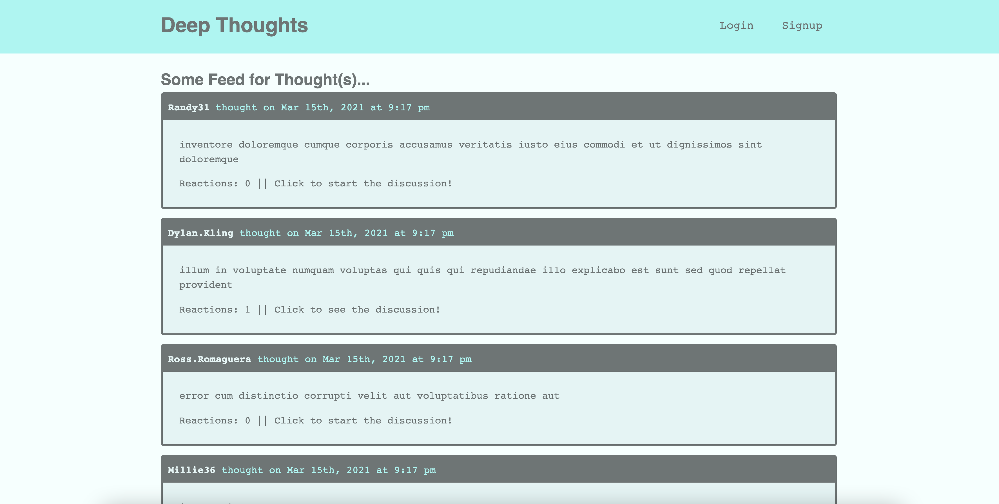

# deep-thoughts

## Description
Deep Thoughts is a social networking site built using the MERN stack. Users will be able to sign up and create an account, post their thoughts, and interact with other users by reacting to their thoughts and adding them as friends.

## Built With
* MongoDB
* Express.js
* Reactjs
* Node.js
* GraphQL

[Deep Thoughts page](https://ancient-castle-37434.herokuapp.com/)